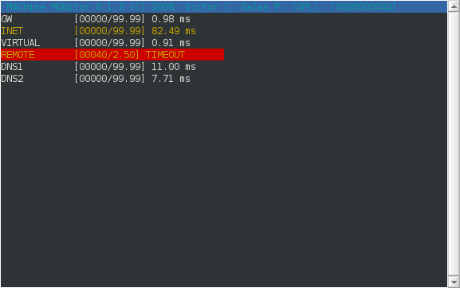

### MACHINE MONITOR

Copyright (C) 2006,2012 Victor C Salas (aka nmagko)

This program is free software; you can redistribute it and/or modify it
under the terms of the GNU Public License as published by the Free
Software Foundation; either version 3 of the license or (in your
opinion) any later version.

### WHAT IS THE MACHINE MONITOR?

The machine monitor is a computer software written in C for sensing
computer availability with ICMP packets. It uses raw sockets to reduce
bandwidth and it shows round trip time with different colors. It runs
under GNU/Linux Operating Systems and Windows through Cygwin.



### DEPENDS

- make

- gcc

- ncurses

- pthread

- uregex [1]

### RECOMMENDS

- Perl

- gnuplot

### PROVIDES

- machon: the machine is on, the main executable

- pinga: ping-amateur version

- hole: host-less version

- machonanal: the machine is on the analyzer, written in Perl

### FAST NOTES

You have to create symb link according to your Operating System:

- Makefile.unix, GNU/Linux, and Unix with GNU system support

- Makefile.cygwin, Windows with Cygwin support

It needs at least a terminal with 40 columns and it creates daily logs
to plot charts.

In Windows you have to keep the compiled version folder of liburegex at
the same path level as the machon folder, for example:

```
cygwin:~# cd sources
cygwin:~/sources# ls -p
liburegex/ machon/
```

### HOW TO COMPILE AND INSTALL

As root goes to the machon/src folder, so, you have to run the:

```
make
make install
```

### HOW TO UNINSTALL

As root goes to the machon/src folder, so, you have to run the:

```
make uninstall
make clean
```

### HOW TO MAKE IT WORK

You have to create /etc/machon.hosts file, for example:

```
MYAP=192.168.1.1
SERVER1=192.168.1.254
GOOGLE=google.com
ROUTER1=192.168.1.2
```

Don't forget, one line per host.

You can start the program execution running:

machon

It creates daily logs in /var/log/ so you can create gnuplot graphics
with the machonanal utility:

machonanal /var/log/machon-YYYY-MM-DD.log

It creates machon.saved folder with plot scripts (.plt). Each time you
run this utility overwrites machon.saved folder.

### REFERENCES

[1] liburegex, https://savannah.gnu.org/projects/liburegex/

P.S.

Write me an email if you have any questions, please use American English
or Spanish, I will reply to you when I get time.

### FREE DOCUMENTATION LICENSE

Copyright (C) 2012,2016 Victor C Salas

  Permission is granted to copy, distribute, and/or modify this document
  under the terms of the GNU Free Documentation License, Version 1.3 or
  any later version published by the Free Software Foundation; with no
  Invariant Sections, no Front-Cover Texts, and no Back-Cover Texts. A
  copy of the license is included in the section entitled "GNU Free
  Documentation License".
